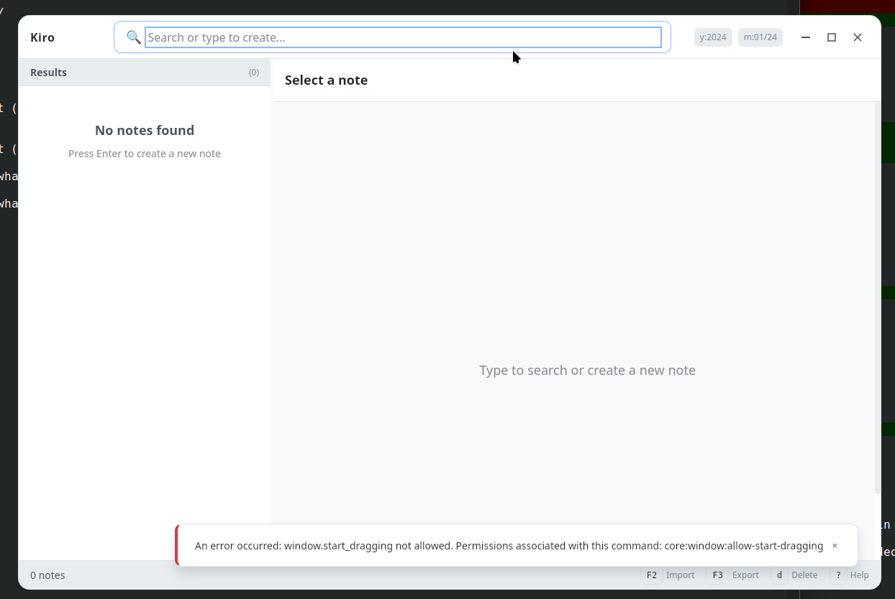

# Kiro

A modern, keyboard-driven notes application built with Tauri 2 and Rust.



## Features

- **Fast SQLite Backend** - All notes stored locally in a SQLite database
- **Vim-Style Navigation** - Navigate with `j/k`, jump with `g/G`, page with `Ctrl+D/U`
- **Powerful Search** - Full-text search with date filters (`y:2024`, `m:01/24`)
- **Bulk Operations** - Mark multiple notes for batch delete or export
- **Import/Export** - Import text files, export to Markdown
- **8 Theme Presets** - Dark, Light, Nord, Solarized, Dracula, Monokai, Ocean, High Contrast
- **Customizable** - Adjust fonts, colors, and panel sizes
- **Resizable Panels** - Drag the divider between results and preview panels

## Requirements

### System Dependencies

**Linux (Debian/Ubuntu):**
```bash
sudo apt update
sudo apt install libwebkit2gtk-4.1-dev libgtk-3-dev libayatana-appindicator3-dev librsvg2-dev
```

**Linux (Fedora):**
```bash
sudo dnf install webkit2gtk4.1-devel gtk3-devel libappindicator-gtk3-devel librsvg2-devel
```

**Linux (Arch):**
```bash
sudo pacman -S webkit2gtk-4.1 gtk3 libappindicator-gtk3 librsvg
```

### Rust Toolchain

Install Rust via [rustup](https://rustup.rs/):
```bash
curl --proto '=https' --tlsv1.2 -sSf https://sh.rustup.rs | sh
```

### Tauri CLI

```bash
cargo install tauri-cli
```

## Installation

### From Source

```bash
# Clone the repository
git clone https://github.com/dlbradford/kiro.git
cd kiro

# Build and run in development mode
cargo tauri dev

# Build release binary
cargo tauri build
```

The release binary will be located in `target/release/bundle/`.

## Usage

### Running the Application

**Development mode (with hot reload):**
```bash
cargo tauri dev
```

**Production build:**
```bash
cargo tauri build
./target/release/kiro-gui
```

### Keyboard Shortcuts

#### Navigation
| Key | Action |
|-----|--------|
| `j` / `↓` | Move selection down |
| `k` / `↑` | Move selection up |
| `g` | Jump to first result |
| `G` (Shift+g) | Jump to last result |
| `Ctrl+D` | Page down (10 items) |
| `Ctrl+U` | Page up (10 items) |
| `Tab` | Toggle focus between search and results |

#### Actions
| Key | Action |
|-----|--------|
| `Enter` | Edit selected note / Create new note |
| `Space` | Toggle mark on selected note |
| `a` | Mark all visible notes |
| `c` | Clear all marks |
| `d` | Delete selected/marked notes |

#### Import/Export
| Key | Action |
|-----|--------|
| `F2` | Open import dialog |
| `F3` | Export marked notes |
| `F4` | Configure directories |

#### Editor
| Key | Action |
|-----|--------|
| `Ctrl+S` | Save note |
| `Escape` | Cancel editing |

#### General
| Key | Action |
|-----|--------|
| `Escape` | Clear search / Close dialog |
| `Ctrl+Q` | Quit application |
| `Ctrl+,` | Open settings |
| `?` | Show help |

### Search Syntax

- **Text search:** Type any text to search in titles and bodies
- **Year filter:** `y:2024` or `year:2024`
- **Month filter:** `m:01/24` or `month:01/24`
- **Combined:** `y:2024 meeting notes` (notes from 2024 containing "meeting notes")

### Data Storage

| Data | Location |
|------|----------|
| Database | `~/.local/share/kiro/notes.db` |
| Config | `~/.config/kiro/config.json` |
| Exports | `~/Downloads/kiro-export/` |

## Configuration

### Theme Presets

Access via `Ctrl+,` or the settings panel:

- Dark (default)
- Light
- Nord
- Solarized Dark
- Dracula
- Monokai
- Ocean
- High Contrast

### Font Settings

Customize the font family, size, and monospace font in the settings panel.

## Architecture

```
kiro/
├── src/
│   ├── main.rs          # Application entry point
│   ├── lib.rs           # Tauri app initialization
│   ├── commands.rs      # Tauri IPC commands
│   ├── config.rs        # Configuration management
│   ├── error.rs         # Error types
│   └── store/
│       ├── mod.rs       # SQLite note store
│       └── note.rs      # Note data structures
├── ui/
│   ├── index.html       # Main HTML
│   ├── js/              # JavaScript modules
│   │   ├── app.js       # App initialization
│   │   ├── api.js       # Backend API calls
│   │   ├── search.js    # Search functionality
│   │   ├── editor.js    # Note editor
│   │   ├── keyboard.js  # Keyboard shortcuts
│   │   ├── settings.js  # Settings panel
│   │   ├── import.js    # Import dialog
│   │   └── utils.js     # Utilities
│   └── styles/
│       ├── theme.css    # Theme definitions
│       ├── main.css     # Main styles
│       └── components.css
├── tests/
│   └── test_runner.html # Manual test suite
├── Cargo.toml           # Rust dependencies
└── tauri.conf.json      # Tauri configuration
```

## Testing

See [TESTING.md](TESTING.md) for detailed test cases and instructions.

Quick start:
```bash
# Run the application
cargo tauri dev

# Open the test runner in a browser
# file:///path/to/kiro/tests/test_runner.html
```

## Contributing

1. Fork the repository
2. Create a feature branch (`git checkout -b feature/amazing-feature`)
3. Commit your changes (`git commit -m 'Add amazing feature'`)
4. Push to the branch (`git push origin feature/amazing-feature`)
5. Open a Pull Request

## License

This project is open source. See the repository for license details.

## Acknowledgments

- Built with [Tauri 2](https://tauri.app/)
- Icons and design inspired by modern note-taking applications
- Developed collaboratively with Claude
